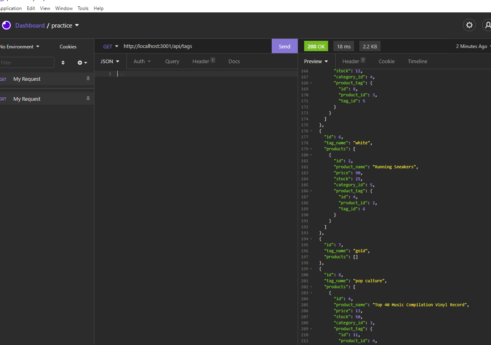

## Title
E-Commerce Backend
## Table of Contents
[Title](#title)

[Description](#description)

[Installation](#installation)

[Usage](#usage)

[Test](#test)

[License](#license)

## Description
This project was build using node, express, mysql2, and sequelize. The application has several table models, CRUD routes, and a seed file as well.
## Installation
clone this repo into your folder, run npm i followed by npm (your server.js file)
# Usage
npm i to install the dpendencies, npm run seed to fill the database, then run node server.js
## Test
npm run start
## Questions
if you have any additional questions, please contact me using the following links below:
Github: [https://github.com/JaredC71](https://github.com/JaredC71)
 
Email Adress: jaredcolletti123@gmail.com 
## License 